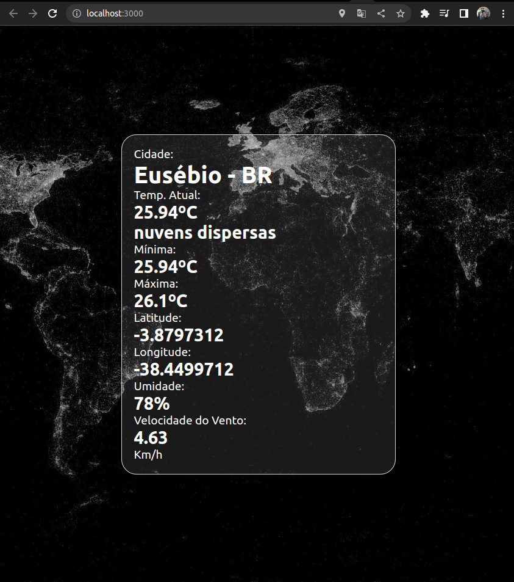
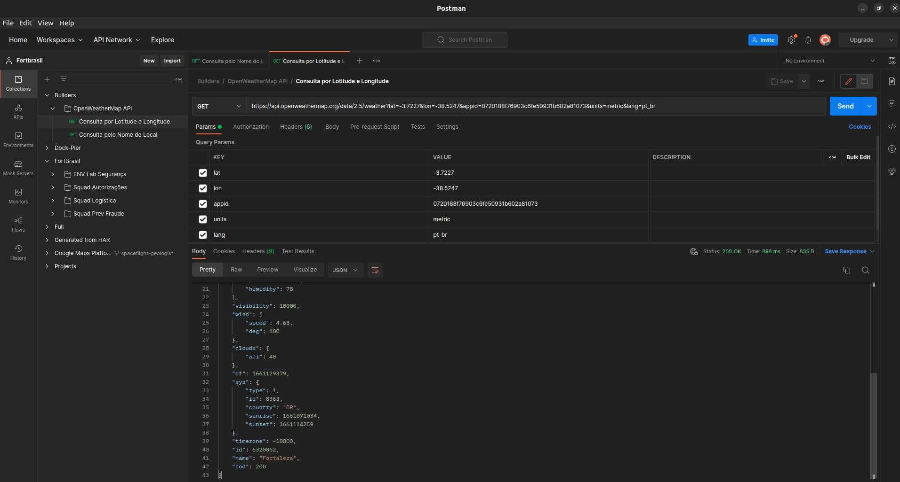

<p align="center">
  <a href="https://reactjs.org/" target="blank"></a>
</p>


# Descrição do Projeto
```
App para mostrar a Posição atual e dados climáticos de sua posição atual 
```

## Procedimento de instalação e usabilidade do app
```
Registre-se no site da API:
https://openweathermap.org/

Inclua sua chave no src/App.js
linha 28 em appid=XXXXXXXXXXXXXXXXXXX
```

## Instale o Pacote 
```
npm install
```

## após isto rode o projeto
```
npm start
```

Acesse via.\
Endereço [http://localhost:3000](http://localhost:3000) no browser.

## Para executar testes
```
npm test
```

## gerar build
```
npm run build
```

## Tela após rodar o projeto
 

## Postman
 

## Suporte:
``` 
E-Mail:   gpatricio.melo@gmail.com 
WhatsApp: (85) 9 9763-5122
```
